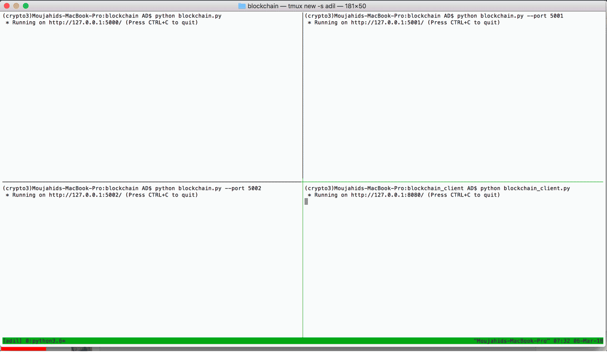

# Cryptocurrency Transfer Application

## INTRODUCTORY BLOCKCHAIN CONCEPTS

### 1. Why Blockchain?
In 2010, a programmer paid 10,000 Bitcoins for 2 pizzas, roughly worth $30. In 2018, that same number of bitcoins is estimated at $83 million in value!

The exchange of Bitcoin is possible due to an underlying technology that secures and simplifies transactions removing the need for a bank or a central authority. Anyone with an internet connection has the freedom to own and exchange this digital currency. The powerful architecture that drove this revolution was blockchain. Businesses started to realize the potential of blockchain and are rapidly mobilizing to understand and implement it. But, what exactly is blockchain and what makes it so transformative?

### 2. What is Blockchain?
The blockchain is similar to a permanent book of records that keeps a log of all transactions that have taken place in chronological order.

Let’s envision a bank transaction in which there are three parties: the sender, the bank, and the recipient. In order to ensure that there are no fraudulent transactions, the bank acts as the central authority between the parties.

The blockchain also logs transactions between senders and receivers, except there is no bank or central authority. Instead, the blockchain relies on a public network of computers to verify the transaction. The blockchain is just an accurate, and permanent record of all the transactions that have happened amongst the members in that blockchain’s network. In this analogy, each block in the blockchain represents a transaction, and each transaction is connected to the prior transaction to form the entire connected blockchain.

___Key Terms:___

- ___Block:___ A block is an individual transaction or piece of data that is being stored within the blockchain.
- ___Blockchain:___ A blockchain is a continuously growing list (“chain”) of records (“block”), called blocks, which are linked chronologically and secured using cryptography.

### 3. The Blockchain Network
So how do Blockchain-based applications like Bitcoin and Ethereum validate transactions without a central authority?

In the blockchain, there are many participants in the network that are constantly checking to ensure that each transaction is valid. Each participant is a computer that owns a copy of the blockchain. These participants cross-reference their copy of the blockchain each time a new block is being introduced. Because this validation depends on multiple participants, the digital record is “decentralized”.

In order for a new block to be added, 51% of all of the participants in the blockchain network must verify that the new block is not fraudulent. Once a block has been verified as a valid transaction, it is added to each participant’s copy of the blockchain.

By having the majority of participants validate a new transaction, the blockchain removes the need for a central authority and automates the completion of transactions, reducing transaction fees while ensuring a high level of security.

___Key Terms:___

- ___Blockchain Network:___ The blockchain network and blockchain are terms used interchangeably. They represent the entire blockchain from the structure itself to the network that it is a part of.
- ___Decentralization:___ The concept in which participants work together to validate transactions without relying on a central authority.
- ___Participant:___ A client that owns a copy of the blockchain and verifies transactions across the network.

### 4. What are Blocks in the Blockchain?
Just like bricks are the building blocks of a house, blocks themselves are the building blocks of a blockchain.

A block contains transaction data and other important details related to the creation of that block, such as the time when it was created and other unique information. In order to create a block, we must have a record that we wish to store.

The blocks can hold different types of data depending on what the blockchain is used for. However, at its heart, a block will always contain a timestamp or the data regarding the time when the block was created. A block will also always contain a unique hash or a unique code produced by combining all the contents within the block itself — also known as a digital fingerprint. Lastly, a block will also always contain a previous hash or a reference to the prior block’s hash. This reference to the prior block is how blocks chain to one another. We will dive into more details about the hash later. These attributes about a block are what make it part of a blockchain structure.

___Properties in a Block:___

- ___Timestamp:___ The time the block is created determines the location of it on the blockchain.
- ___Transaction Data:___ The information to be securely stored in the block.
- ___Hash:___ A unique code produced by combining all the contents within the block itself — also known as a digital fingerprint.
- ___Previous Hash:___ Each block has a reference to the block prior to its hash. This is what makes the blockchain unique because this link will be broken if a block is tampered with.

### 5. Hashing
Hashing is an application of cryptography that is fundamental to the design of the blockchain. It is a way to generate a seemingly random, but calculated string of letters and numbers from any input. This is accomplished by the use of a hash function.

Think of a hash function as a machine that takes an object, such as an apple, and turns it into a varying combination of letters and numbers, such as “1a432bf”. The output (“1a432bf”) is known as the hash of the input, the apple. If you give the machine two apples instead of one, it will return a different hash (such as “26f5ce1”).

There are many types of machines out there, so the resulting hash varies from machine to machine. Similarly, there are many types of hash functions available. Blockchain uses a cryptographic hash function, meaning that the output is random but deterministic. This means the same input will always produce the same hash. That process is one-way, so the output (hash) cannot be used to produce the original input.

___Key Terms:___

- ___Deterministic:___ The same input will always produce the same output, but that output cannot produce the original input.
- ___Hash:___ A calculated string of letters and numbers produced from a specific input.
- ___Hash Function:___ A function that takes in an input of a random size, performs hashing on the input, and generates a seemingly random output of a fixed size, also known as the hash.

### 6. The Genesis Block
To recap, a blockchain is similar to a permanent book of records — it keeps an accurate unchanging record of all data, or transactions, stored in chronological order. Each block has a reference to the block’s previous hash. This is how blocks are “chained” together. If a block’s contents are tampered with, the block’s hash changes and the chain breaks, making it difficult to successfully tamper with any one piece of the chain.

Since all blocks in the blockchain have a reference to the previous block, the first block is a little different than the rest. It is known as the Genesis Block. The problem, however, is that the Genesis Block does not have a block before it. So it wouldn’t make sense to have a previous hash stored inside it. To resolve this minor issue, the value of the previous hash is typically hard-coded into the Genesis Block with the default value of zero.

___Key Terms:___

- ___Genesis Block:___ The genesis block is the first block on the blockchain and it is typically hard-coded into the blockchain structure. Being the first block on the blockchain, it does not have a link to a previous hash.


<div style="display:block;margin:auto;height:80%;width:80%">
  
</div>

The github repository contains a basic implementation of a blockchain and its client using Python. This blockchain has the following features:

- Possibility of adding multiple nodes to the blockchain
- Proof of Work (PoW)
- Simple conflict resolution between nodes
- Transactions

The blockchain client has the following features:

- Generation of transactions. 

This github repository also contains 2 dashboards: 

- "Blockchain Frontend" for miners. 
- "Blockchain Client" for users to send transactions. 


# Dependencies

- Works with ```Python 3.8.8``` 

# Installation

1. install [python](https://www.python.org/downloads/)
2. install required packages:
    ```pip install requests```
    ```pip install flask```
    ```pip install flask-core```
3. install [git](https://git-scm.com/downloads)
4. download the code from Github
    ```git clone https://github.com/omarkandil22/Cryptocurrency-Transfer-Application.git```

# How to run the code

1. To start a blockchain node, go to ```blockchain``` folder and execute the command below:
```python blockchain.py -p 5000```
2. You can add a new node to blockchain by executing the same command and specifying a port that is not already used. For example, ```python blockchain.py -p 5001```
3. TO start the blockchain client, go to ```blockchain_client``` folder and execute the command below:
```python blockchain_client.py -p 8080```
4. You can access the blockchain frontend and blockchain client dashboards from your browser by going to localhost:5000 and localhost:8080
